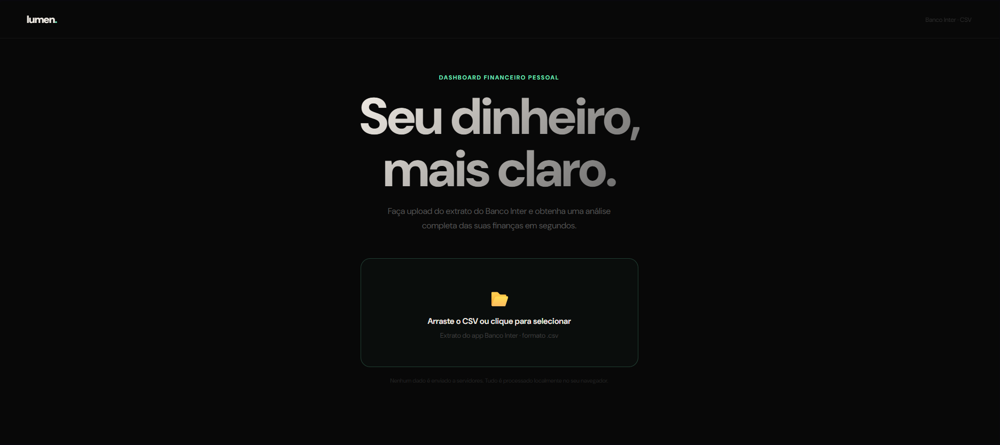

# 💡 Lumen 

> Dashboard financeiro pessoal para análise inteligente de extratos do Banco Inter.




**[→ Acessar o app](https://lumen-finance.vercel.app)**

---

## O que é

O Lumen transforma o extrato CSV do Banco Inter em uma análise financeira completa — categorização automática, gráficos de tendência, identificação de gastos recorrentes e um score de saúde financeira, tudo rodando diretamente no seu navegador.

Nenhum dado é enviado a servidores. Todo o processamento acontece localmente.

---

## Funcionalidades

| | |
|---|---|
| 📊 **Visão Geral** | 8 KPIs principais com variação por período |
| 📈 **Tendências** | Gráficos de gastos, entradas e taxa de poupança mensal |
| 🎯 **Categorias** | Distribuição por donut chart + ranking com barras de progresso |
| 🔁 **Recorrências** | Detecção automática de gastos que se repetem |
| 💡 **Insights** | Score de saúde financeira (0–100) + recomendações inteligentes |
| 📋 **Transações** | Tabela completa com busca, ordenação e exportação CSV |

---

## Como usar

1. Acesse o app em **[lumen-finance.vercel.app](https://lumen-finance.vercel.app)**
2. No app do Banco Inter, exporte seu extrato em formato `.csv`
3. Faça o upload do arquivo no Lumen
4. Explore sua análise financeira

---

## Rodando localmente

```bash
# Clone o repositório
git clone https://github.com/Zanderzin/lumen-finance.git
cd lumen-finance

# Instale as dependências
npm install

# Inicie o servidor de desenvolvimento
npm run dev
```

Acesse em `http://localhost:5173`

---

## Stack

- **[React 18](https://react.dev)** — interface
- **[Vite 5](https://vitejs.dev)** — build e dev server
- **Zero dependências externas** — gráficos feitos em SVG puro, sem bibliotecas de chart

---

## Privacidade

O Lumen processa tudo localmente no seu navegador via FileReader API. Nenhum arquivo, dado financeiro ou informação pessoal é transmitido a qualquer servidor.

---

## Licença

MIT © [Zanderzin](https://github.com/Zanderzin)
